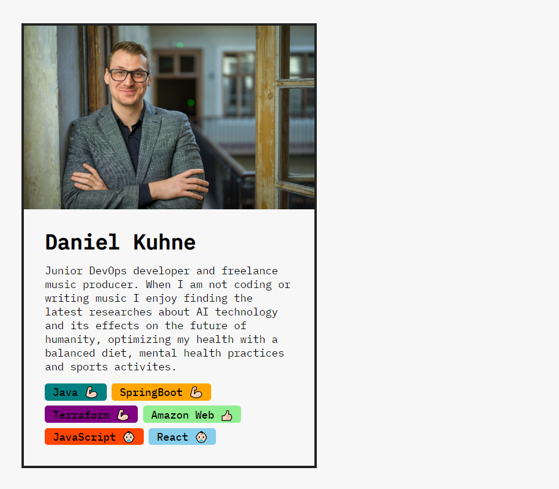

# Simple profile card

## Information

I created this simple profile card as the first static **React** page since I began learning **React** & **JavaScript**.  
I learned how to :

- Create `components`
- Pass `props` from parent to child components
- Write `JSX` in components for _data, logic, appearance_
- Render _Lists_ using `.map` function
- Render certain components `conditionally`

*** 

[Back to main folder](https://github.com/mrkuhne/React-Projects/tree/main)