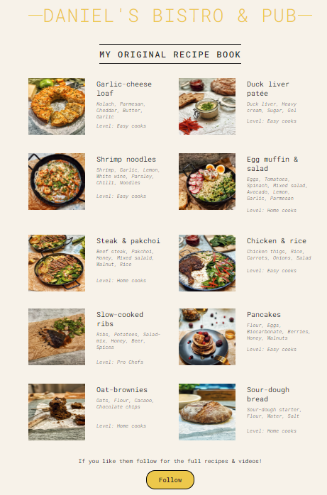

# My Original Recipes from Instagram

## Information

Continuing my learning with React I downloaded some of my instagram pictures of recipes I came up with and created a static page where I show the pictures, the names, some ingredients and a level.

- Every food is **Listed** dynamically from a `const foodArray` and the levels are converted to text from numbers designated in the food objects properties.
- Instead of using generic props, I am taking the `Food components` props as a whole foodObject with the parent component `foodList`
- I am using arrow functions:  
  `const MyFunction = () => return "My function"; `  
  instead of traditional functions  
  `function MyFunction = {return "My function"};`
